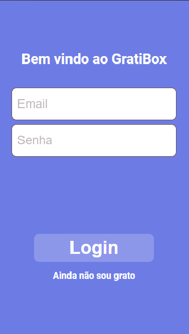
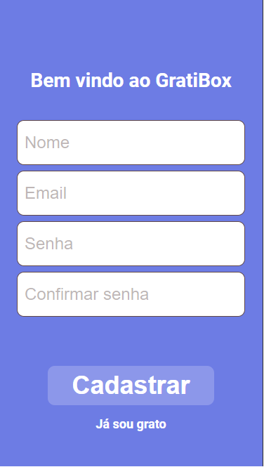
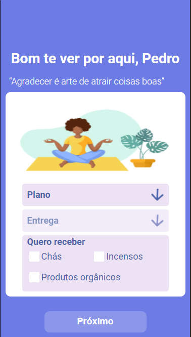
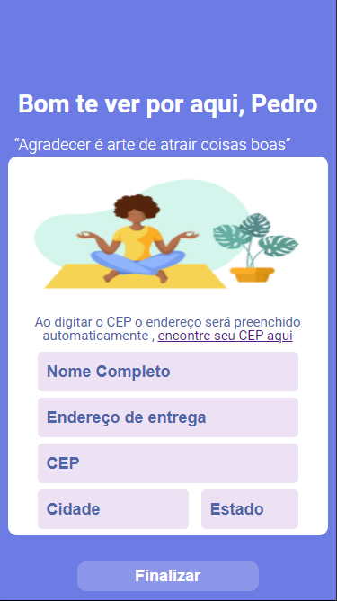
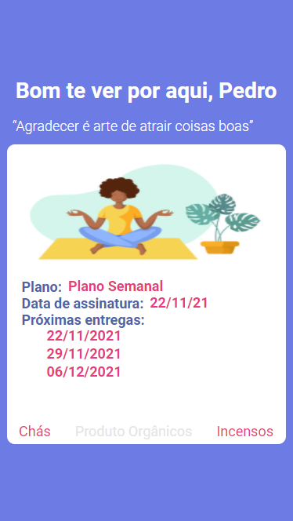

<h1 align="center"> GratiBox </h1>

# Description
Gratibox is an aplication to sign for plans, the are two types of plans that the user can get, first you have to create an account to enter the app, then you should login. You will get to the page to choose the plans. To subscribe to a plan, the user must select the delivery days, and the shipping location informations. After you have signed to a plan it will show in the /subscription page. 

# Layout

 
 
 
 
 
 
 

 Figma file <a href="https://www.figma.com/file/wHTsMeg2oVdW96ptraU2Gb/GratiBox?node-id=0%3A1">here</a>
---

# Getting started

## Running on [vercel](https://grati-box-front-end.vercel.app)

This project needs backend running to work,
to run the backend, follow the instructions on [Gratibox-API](https://github.com/pedrohotz/GratiBox-API)

The following tools were used in the construction of the project:

**Frontend**  ([React](https://reactjs.org/))

-   **[Axios](https://github.com/axios/axios)**
-   **[CEP-Promise](https://github.com/BrasilAPI/cep-promise)**
-   **[Dayjs](https://github.com/iamkun/dayjs)**
-   **[React-icons](https://github.com/react-icons/react-icons)**
-   **[React-router-dom](https://github.com/remix-run/react-router)**
-   **[Styled-components](https://github.com/styled-components/styled-components)**
-   **[SweetAlert2](https://github.com/sweetalert2/sweetalert2)**

## Author

Developed by Pedro Hotz Bronzato.